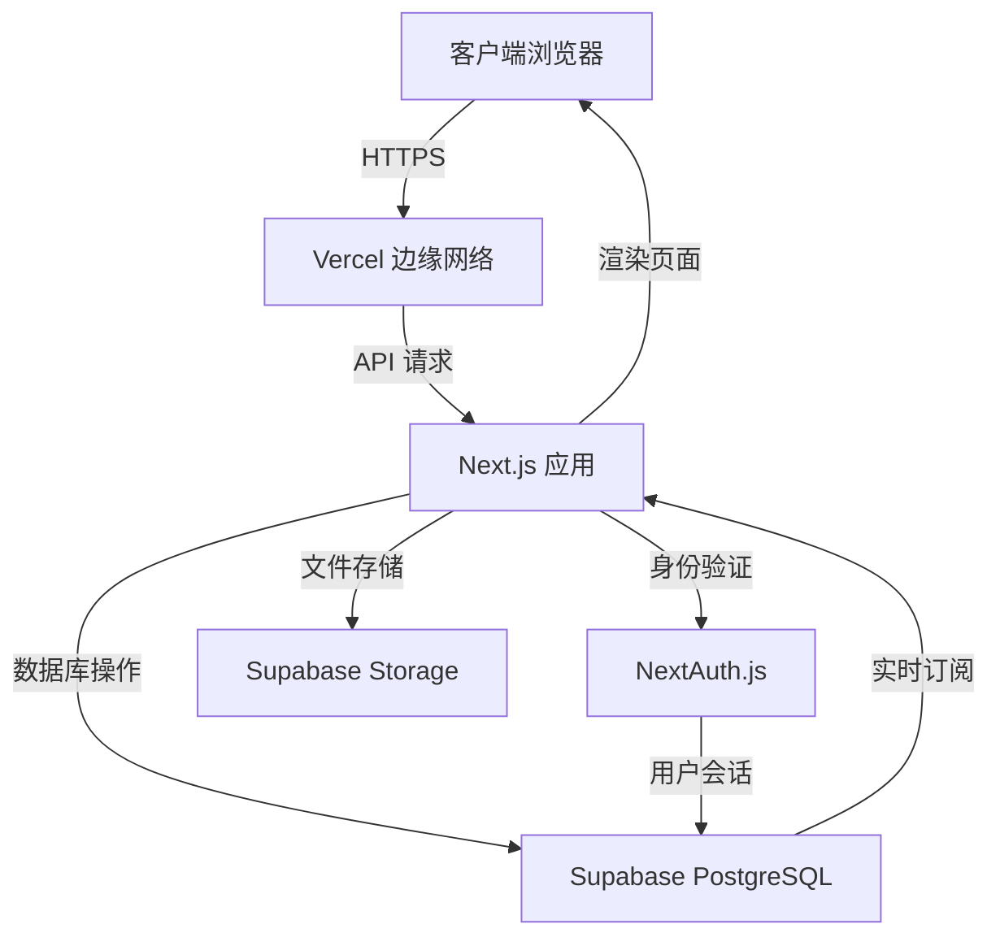

# PC Service Hub 改进计划

## 执行摘要
PC Service Hub 是一个基于 Next.js 的电脑维修预约平台，目前处于原型阶段。通过架构评估，发现了数据持久化、组件结构、安全性、测试覆盖率和文档等方面的改进机会。本计划旨在提供系统化的改进方案，以提升项目的可维护性、安全性和可扩展性。

## 当前架构概述
- **前端**: Next.js 14 (App Router), TypeScript, Tailwind CSS, shadcn/ui 组件
- **状态管理**: React Hook Form + Zod 表单验证
- **数据持久化**: 客户端 localStorage（仅限浏览器）
- **身份验证**: 管理页面使用环境变量密码 + sessionStorage
- **部署**: 未部署，本地开发环境
- **测试**: 无单元测试或集成测试
- **文档**: PRD 文件为空，缺乏项目文档

## 改进领域与详细建议

### 1. 数据持久化
**现状**: 使用 `localStorage` 存储订单数据，导致数据无法跨设备同步、易丢失，且无法支持多用户场景。

**建议方案**:
- **短期**: 引入轻量级后端 API，使用 Next.js API Routes 配合 SQLite 或 PostgreSQL。
- **长期**: 采用全功能后端即服务（BaaS），如 Supabase（提供数据库、身份验证、实时订阅）或 Firebase。
- **迁移步骤**:
  1. 创建 Next.js API 路由 (`/api/orders`) 实现 CRUD 操作。
  2. 使用 Prisma ORM 定义数据模型，连接 PostgreSQL 或 SQLite。
  3. 将现有 `order.ts` 中的函数改为调用 API。
  4. 保留 localStorage 作为离线降级方案（可选）。

**技术选型**:
- **数据库**: Supabase（推荐，免费层足够）或 Vercel Postgres。
- **ORM**: Prisma 或 Drizzle。
- **API 风格**: RESTful 或 tRPC（类型安全）。

### 2. 组件重构
**现状**: `BookingForm` 组件长达 532 行，包含多步表单逻辑、UI 渲染和业务逻辑，违反单一职责原则。

**重构目标**:
- 将每个步骤拆分为独立子组件：`ServiceStep`、`DeviceStep`、`LocationStep`、`TimeStep`。
- 提取表单状态和验证逻辑到自定义 Hook `useBookingForm`。
- 将 UI 片段（如服务选项卡片）提取为可复用组件。
- 采用复合组件模式提高可测试性。

**示例结构**:
```
src/components/booking/
├── BookingForm.tsx           # 主组件，协调步骤和提交
├── useBookingForm.ts         # 表单状态、验证、导航逻辑
├── steps/
│   ├── ServiceStep.tsx
│   ├── DeviceStep.tsx
│   ├── LocationStep.tsx
│   └── TimeStep.tsx
└── ui/
    ├── ServiceCard.tsx
    └── Stepper.tsx
```

### 3. 身份验证与安全性
**现状**: 管理页面通过环境变量 `NEXT_PUBLIC_ADMIN_PASSWORD` 进行简单密码验证，身份验证状态存储在 `sessionStorage` 中，存在 XSS 风险和密码暴露可能。

**改进建议**:
- 使用 NextAuth.js 实现基于会话的身份验证，支持多种提供商（Credentials、Google 等）。
- 为管理员角色创建数据库用户表，存储哈希密码。
- 移除环境变量中的明文密码，改为使用哈希对比。
- 在 API 路由中添加中间件进行权限检查。
- 实施 CORS、速率限制和输入验证。

**实施步骤**:
1. 安装 NextAuth.js 并配置 Credentials 提供商。
2. 创建 `pages/api/auth/[...nextauth].ts` 路由。
3. 将管理页面包装在 `getServerSideProps` 或中间件中，验证会话。
4. 移除现有的 `useAdminGate` 逻辑。

### 4. 测试策略
**现状**: 项目没有任何测试，存在回归风险。

**测试金字塔**:
- **单元测试**: 使用 Jest + React Testing Library 测试工具函数 (`order.ts`)、自定义 Hook 和纯 UI 组件。
- **组件测试**: 测试 `BookingForm` 和各步骤组件的交互与状态。
- **集成测试**: 使用 Cypress 或 Playwright 测试完整用户流程（填写表单、提交、查看管理页面）。
- **API 测试**: 使用 Supertest 测试 Next.js API 路由。

**配置**:
- 在 `package.json` 中添加测试脚本。
- 设置 Jest 配置支持 TypeScript 和 CSS 模块。
- 添加 CI 流水线（GitHub Actions）自动运行测试。

**优先级**:
1. 为 `order.ts` 中的工具函数编写单元测试。
2. 为 `BookingForm` 组件编写组件测试。
3. 添加端到端测试覆盖关键用户旅程。

### 5. 文档完整性
**现状**: PRD、UI、Development 文档均为空文件，缺乏项目上下文。

**文档计划**:
- **项目 README**: 包含项目描述、技术栈、本地开发指南、部署说明。
- **架构文档**: 在 `/docs` 目录下记录系统设计、数据流、组件关系。
- **API 文档**: 使用 OpenAPI/Swagger 或简单 Markdown 描述 API 端点。
- **贡献指南**: 说明代码风格、提交规范和测试要求。

**立即行动**:
1. 填充 `PRDs/PRD.md` 包含需求描述、用户故事和验收标准。
2. 更新 `README.md` 包含完整的设置步骤。
3. 创建 `docs/architecture.md` 描述当前和改进后的架构。

### 6. 部署与可扩展性
**现状**: 项目仅在本地运行，未配置生产部署。

**部署目标**:
- 使用 Vercel（Next.js 原生平台）进行一键部署。
- 配置环境变量（数据库连接字符串、密钥等）。
- 设置自定义域名和 HTTPS。
- 实施 CI/CD 流水线（GitHub Actions）实现自动化测试和部署。

**可扩展性考虑**:
- 采用无服务器架构，利用 Vercel Functions 或 AWS Lambda 处理 API 请求。
- 数据库选择可水平扩展的云数据库（如 Supabase 或 PlanetScale）。
- 引入缓存层（Redis）应对高读取负载。
- 监控与日志：使用 Sentry 或 Logtail 进行错误跟踪。

## 详细行动项（优先级排序）

### 高优先级（核心功能与稳定性）
1. **数据持久化迁移**
   - 创建 Supabase 项目并设置数据库表。
   - 实现 Next.js API 路由用于订单 CRUD。
   - 修改 `order.ts` 调用 API 替代 localStorage。
   - 测试数据迁移流程。

2. **组件重构**
   - 拆分 `BookingForm` 为子组件。
   - 提取自定义 Hook 管理表单状态。
   - 确保 UI 和行为保持不变。

3. **身份验证升级**
   - 集成 NextAuth.js。
   - 创建管理员登录页面。
   - 保护管理路由。

### 中优先级（质量与可维护性）
4. **测试基础建设**
   - 配置 Jest 和 React Testing Library。
   - 编写工具函数和组件单元测试。
   - 添加 CI 流水线。

5. **文档补充**
   - 编写完整的 README 和架构文档。
   - 填充 PRD 文件。

6. **错误处理与用户反馈**
   - 添加全局错误边界。
   - 改善表单提交的网络错误提示。
   - 添加加载状态和成功反馈。

### 低优先级（增强功能）
7. **功能增强**
   - 电子邮件通知（订单确认、状态更新）。
   - 支付集成（微信支付、支付宝）。
   - 预约提醒（短信或邮件）。
   - 多语言支持（i18n）。

8. **性能优化**
   - 代码分割与懒加载。
   - 图片优化（使用 Next.js Image）。
   - 数据库查询优化。

## 技术选型建议
| 领域           | 推荐技术               | 理由                                                                 |
|----------------|------------------------|----------------------------------------------------------------------|
| 后端/数据库    | Supabase               | 免费层足够，集成身份验证、实时数据库、存储，与 Next.js 生态兼容。     |
| 身份验证       | NextAuth.js            | 开源、灵活，支持多种提供商，与 Next.js 深度集成。                    |
| 测试框架       | Jest + RTL + Playwright| 行业标准，覆盖单元、组件和端到端测试。                               |
| 部署平台       | Vercel                 | Next.js 官方平台，自动化构建、预览部署、全球 CDN。                   |
| 监控           | Sentry                 | 错误跟踪、性能监控，免费层可用。                                     |
| 代码质量       | ESLint + Prettier      | 已配置，需确保团队统一规则。                                         |

## 系统架构图（改进后）


## 风险与缓解措施
| 风险 | 影响 | 缓解措施 |
|------|------|----------|
| 数据迁移导致现有订单丢失 | 高 | 实现双写策略，在迁移期间同时写入 localStorage 和新数据库，并提供数据导出工具。 |
| 身份验证迁移影响管理员访问 | 中 | 并行运行新旧身份验证系统，逐步切换，保留回滚方案。 |
| 测试覆盖率提升耗时过长 | 中 | 优先为核心功能编写测试，采用增量覆盖策略，结合代码审查。 |
| 第三方服务（Supabase）依赖 | 低 | 选择成熟服务，监控 SLA，准备备份方案（如导出数据到其他数据库）。 |

## 下一步行动
1. 与团队评审本改进计划，确定优先级和时间安排。
2. 开始实施高优先级任务，建议从数据持久化迁移入手。
3. 定期检查进度，调整计划以适应新发现的需求。

---
*最后更新: 2026-03-19*  
*文档版本: 1.0*